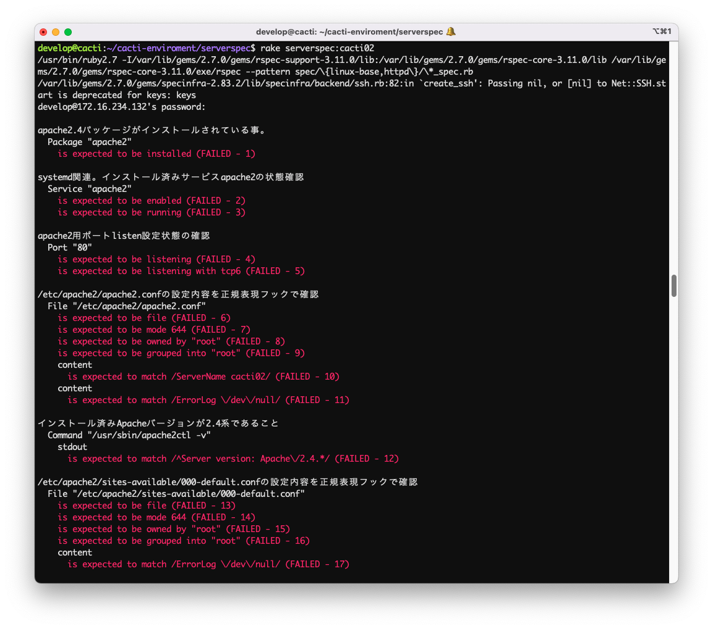
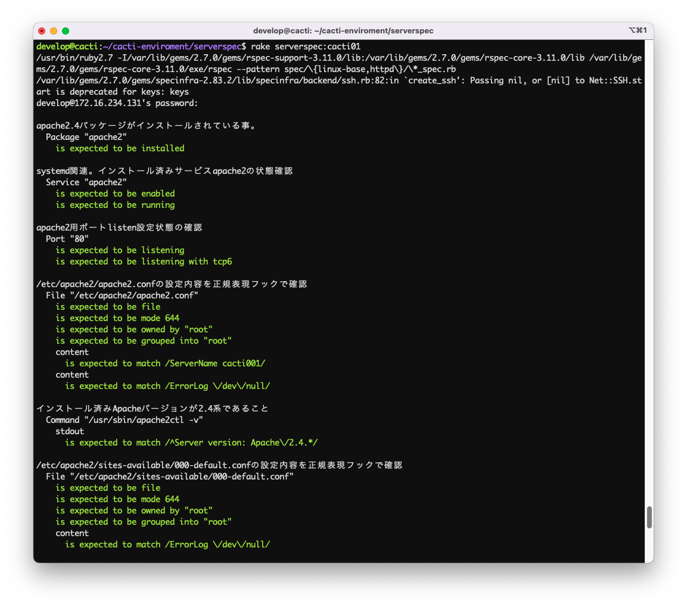
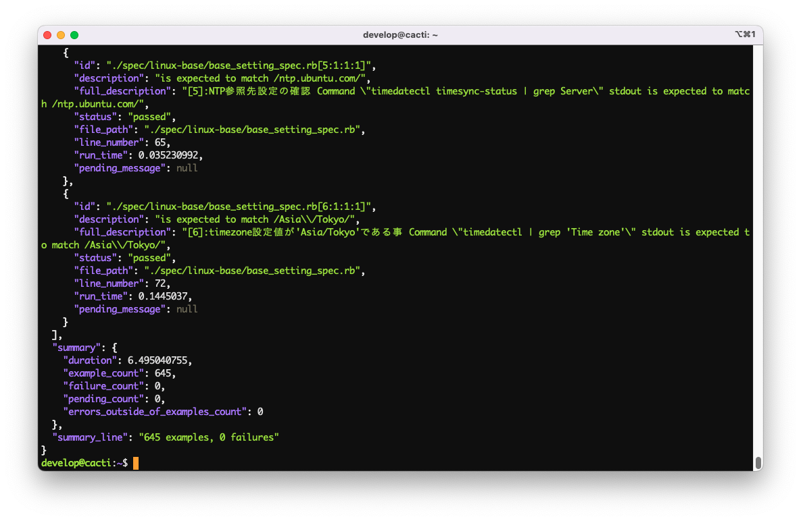

# システム設計書

## 概要

- 「統合網トラフィック可視化基盤」(以後、案件の名称を「可視化案件」と省略表記する)における、トラフィック可視化を実現する為のシステム設計を当該文書にて定義する。

### 設計へのインプットとなる文書・及び仕様

- お客様配布文書「【統合網トラフィック可視化基盤】構築方針書_20220616.pptx」の求める仕様に準拠する。
- 上記文書の要件に基づいて導入するサーバー及びミドルウェア、ソフトウェアは「技術アーキテクチャ標準細則(第17.0版)」及び、外部文書「(別表1)標準化技術リスト(製品サポート情報etc)_20220629」の要件に準拠する。

## 基本設計

### 動作プラットフォーム

- サーバー構築を行う上でのプラットフォームは「【統合網トラフィック可視化基盤】構築方針書_20220616.pptx」2頁、及び3頁にて、お客様ご指定の「Smart Data Platform(以後、SDPFと省略表記する)」上に構築を行う。

  |ワークスペース名|ワークスペースID|説明|
  |---------|--------|---|
  |NW-Visualization_low_SYS7037544-37298|ws0000957886|社内網可視化ツール群 ECL2.0-商用環境-共通網DMZ-FIC接続|

  |リージョン|テナントID|
  |---|---|
  |jp3リージョン(日本/東日本)|87bc7cdf6b6c4a2bbd28497ee6d34bab|

### ネットワーク構成

- SDPF上にお客様側で構築済みのネットワークを使用し、以下の目的を実現する。
- 目的
  - サービス提供(利用者へのトラフィック可視化情報の提供)。
  - データ取得(可視化対象となるネットワーク機器からのSNMP情報取得)。
  - その他、サーバー構築及び、維持・管理の為のパッケージ取得等(インターネット接続)。

  |名前|ロジカルネットワークID|ネットワークアドレス|ゲートウェイ|備考|
  |---|--------|---------|--------|-----|
  |ficgw-segment|5ad05f6a-96e8-45d2-b7df-f4169d643c90|10.223.156.144/28|-|統合網接続用|
  |server-segment|5b775848-c1fe-4faf-8fe0-8bdb7a997a05|10.223.164.96/27|10.223.164.97|サーバー用|

### サーバー名及び、IPアドレス設計

- 「【統合網トラフィック可視化基盤】構築方針書_20220616.pptx」６頁の「基盤構成」に記載の要件に準拠する。サーバー名（及び、サーバーホスト名）は「役割名称(小文字)」+「01/02系統」とする。
- TODO: 構築対象となるVMに割り当てるIPアドレスは「【統合網トラフィック可視化基盤】構築方針書_20220616.pptx」３頁、「業務実施内容(1/2)」に記載の方針に基づき、別途お客様に定義していただく。

      ```bash
      [vFW]─[vLB]─┬[server-segment(10.22.164.96/27)]
                  ├── orion01     10.22.164.100 (orion server01号機)
                  ├── orion02     10.22.164.101 (orion server02号機)
                  ├── orion_db01  10.22.164.102 (orion database01号機)
                  ├── orion_db02  10.22.164.103 (orion database02号機)
                  ├── cacti01     10.22.164.108 (cacti01号機)
                  ├── cacti02     10.22.164.109 (cacti02号機)
                  ├── provision   10.22.164.100 (管理用VM)
                  └── _gateway   10.22.164.97   (DefaultGateway(fw01))
      ```

### ハードウェアリソース

- 「【統合網トラフィック可視化基盤】構築方針書_20220616.pptx」３頁、「業務実施内容(1/2)」に記載のスペック定義方針に基づき、各サーバーに割り当てるハードウェアリソースを以下に定義する。
- orion(01/02号機にそれぞれ下表のリソースを割り当て)
   |cpu|memory|HDD|備考|
   |---|------|---|---|
   |4  |8GB   |500GB|

- orion_db(01/02号機にそれぞれ下表のリソースを割り当て)
   |cpu|memory|HDD|備考|
   |---|------|---|---|
   |8  |16GB   |500GB|ブロックストレージ-1TBをマウント|
  - TODO: ブロックストレージの利用用途を確認。

- cacti(01/02号機にそれぞれ下表のリソースを割り当て)
   |cpu|memory|HDD|備考|
   |---|------|---|---|
   |2  |8GB   |1TB||

- provison(管理用VMのみシングル構成)
   |cpu|memory|HDD|備考|
   |---|------|---|---|
   |2  |8GB   |1TB||

### アプリケーション

- 「[設計へのインプットとなる文書・及び仕様](#設計へのインプットとなる文書・及び仕様)」で定義されたお客様指定のアプリケーションを導入する。
- 導入アプリケーション
    1. cacti
    2. Network Performance Monitor
    3. Microsft SQL Server 2019 Stenderd

----

### Cacti動作環境構築

### アプリケーション

- cactiインストールのソース及び、バージョン定義
  - 「【統合網トラフィック可視化基盤】構築方針書_20220616.pptx」4頁、「業務実施内容(2/2)」より引用。
    > CactiソースコードのバージョンはNTTコムと協議の上、決定する
    - 当該文書記載時点(2022/09/13)での最新の安定版がcacti-1.2.22となっている。
    - アプリケーションはUbuntu公式が提供するaptリポジトリのバージョンが公式サイトの最新安定版と乖離がった為、公式サイトが提供する最新版を直接取得してインストールする方式を採用する。

      ```bash
      # cacti公式サイト（）の対象バージョンダウンロードURL
      wget https://files.cacti.net/cacti/linux/cacti-1.2.22.tar.gz
      ```

### ミドルウェア

- 選定基準
  - Cactiの動作に必要となるミドルウェアを「[設計へのインプットとなる要件、及び、関連文書・仕様](#設計へのインプットとなる文書・及び仕様)」で定義の文書に照らし合わせ、標準利用可能なミドルウェア・バージョンを選定する。
- 必須ミドルウェア(バージョン)
    1. Apache(2.4.x)
    1. php(8.1)
    1. mariadb(10.8)

- アプリケーション導入に付随して導入するネイティブパッケージ[^1]
  - ppa:ondrej/php
  - apt-transport-https
  - software-properties-common
  - dirmngr
  - snmp
  - snmpd
  - rrdtool
  - libmysql++-dev
  - libsnmp-dev
  - help2man
  - dos2unix
  - autoconf
  - dh-autoreconf
  - libssl-dev
  - librrds-perl
  - snmp-mibs-downloader
  - build-essential
  - traceroute
  - jq

- 特記事項
  - php8.1で構築を進めているが、php7から8へメジャーバージョンアップに際して廃止となった関連パッケージ及びメソッドがある為、cactiの動作結果に問題が生じる際は協議の上でcacti公式サイトの想定するバージョン(php7.4以下)へのダウングレードを行うものとする。

  - 上記、cactiのバージョンは構築の方式検討開始時点でcactiの公式サイトで最新の安定版パッケージを選定したが、導入検証作業内において動作の不具合等が確認された場合はお客様と協議の上、バージョンダウン等を行い安定稼働するバージョンで納品を行う。

## 基本構築手順

- 管理用VMより、各サーバー毎にスクリプトでプロビジョニング／テストを実行する為の最低限の環境を手動で構築する。

### 管理用VM

- cactiサーバーを構築する上で付帯作業として構築するcactiサーバーの構成を以下に定義する。

#### 動作環境

- サーバーOS: Ubuntu 20.04.4 LTS
- サーバープロビジョニング方式
  - ansible [core 2.12.6]
    - python version = 3.8.10 (default, Mar 15 2022, 12:22:08) [GCC 9.4.0]
    - jinja version = 2.10.1
- サーバーテスト方式
  - serverspec (2.42.0)
    - ruby 2.7.0p0 (2019-12-25 revision 647ee6f091) [x86_64-linux-gnu]
    - rake, version 13.0.6
- 特記事項
  - サーバープロビジョニング及び、サーバーテスト方式の動作環境となるの各種アプリケーションプラットフォームは要件を充足する上で付帯作業として構築する副産物である為、「[設計へのインプットとなる文書・及び仕様](#設計へのインプットとなる文書・及び仕様)」で求められる技術標準化リストのバージョンを考慮せずに、OSの安定版として提供されているバージョンの物を使用する。
  - 上記のサーバープロビジョニング／テスト動作環境を便宜的に「管理用VM」と定義し当該文書上に記載する。

  1. Ubuntu20.04のインストール[^2]
  1. ホスト名設定[^2]
  1. sshserverインストール[^2]
  1. 初期ユーザーにdevelopユーザー追加

      ```bash
      sudo mkdir /home/develop
      sudo useradd develop -s /bin/bash -h /home/develop
      sudo usermod -aG sudo develop
      sudo chown develop:develop /home/develop
      sudo cp -p ~ubuntu/.bashrc ~develop/.bashrc
      sudo chown develop:develop ~develop/.bashrc
      ```

  1. 固定IP設定ファイル編集

      ```bash
      # 既存の設定ファイル名の末尾にdisabledを付けて無効化しつつバックアップ
      sudo mv /etc/netplan/00-installer-config.yaml /etc/netplan/00-installer-config.yaml.disabled
      # お客様ご指定のIPアドレス／サブネット等の情報をstaticな値で新規ファイルに記載し適用する。
      sudo vi /etc/netplan/01-netcfg.yaml
      ```

      - 以下、01-netcfg.yamlの記入例

      ```yaml
      network:
        ethernets:
          ens33:
            addresses: [10.223.164.110]
            gateway4: 10.223.164.97
            nameservers:
              addresses: [10.39.175.12,10.39.119.76]
              search: []
        version: 2
      ```

  1. netplanコマンドの実行(固定IP設定の適用)

      ```bash
      sudo netplan apply
      ```

  1. proxy設定
      1. ansible/roles/linux-base/templates/etc/profile.d/proxy_setting.shを手動編集し、
    /etc/profile.d/proxy_setting.shとして配備。
      1. ansible/roles/linux-base/templates/etc/apt/apt.conf.d/30proxy.j2を手動編集し、/etc/apt/apt.conf.d/30proxyとして配備。
      - 設定値に関する特記事項
        - 各種パラメーター設定値はansible/vars/production.ymlを参照。
        - 尚、パラメーターproxy_passに関しては、該当ユーザーのAzureAD認証情報と同一値となる為、仮の値(文字列「replace」)をansibleのスクリプト実行前直前で置換して対応する。

  1. cacti01/02への名前解決設定(/etc/hostsで名前解決)

     ```bash
     10.22.164.100 orion01
     10.22.164.101 orion02
     10.22.164.102 orion_db01
     10.22.164.103 orion_db02
     10.22.164.108 cacti01
     10.22.164.109 cacti02
     ```

  1. SSH公開鍵作成(ED25519鍵)

      ```bash
      # 参考-> https://linuxfan.info/ssh-ed25519
      ssh-keygen -t ed25519
      ```

  1. ssh-copy-idコマンドによるcacti01/02への公開鍵認証設定の実施。

      ```bash
        ssh-copy-id develop@[remote_host]
      ```

  1. ssh公開鍵認証設定

      ```bash
      # ~develop/.ssh/configの記入例
      Host cacti01
        HostName 10.223.164.xx
        User develop
        Port 22
        IdentityFile ~/.ssh/id_ed25519
      ```

  1. サーバープロビジョニングツール:ansibleインストール

      ```bash
      sudo apt update -y
      sudo apt install -y software-properties-common
      sudo apt-add-repository --yes --update ppa:ansible/ansible
      sudo apt install -y ansible
      # インストール済み確認コマンド
      ansible --version
      #=>ansible [core 2.12.6] 以下、省略
      # インストール処理中にYes/No等対話形式入力に対応する為のモジュール追加
      sudo apt install python3-pip
      sudo pip install pexpect
      ```

  1. サーバー構成テストツール：sarverspecインストール

      ```bash
      sudo apt install ruby ruby-dev
      # rubyパッケージ管理システムgemは、環境変数http_proxyを参照してproxyの適用を判断する。
      sudo gem install serverspec
      # 確認コマンド
      gem list serverspec
      #=> serverspec (2.42.0)
      sudo gem install rake
      # 確認コマンド
      rake -V
      # 依存関係パッケージのインストール(公開鍵認証->ed25519対応の為のパッケージ)
      sudo gem install highline ed25519 bcrypt_pbkdf
      ```

#### cacti01/02(共通)

  1. Ubuntu20.04のインストール[^2]
  1. ホスト名設定[^2]
  1. sshserverインストール[^2]
  1. 初期ユーザーにdevelopユーザー追加[^3]
  1. 固定IP設定ファイル編集
      - 管理用VM側の手順を参照。
  1. netplanコマンドの実行(固定IP設定の適用)
      - 管理用VM側の手順を参照。

### cacti01/02サーバープロビジョニング／テスト実行方法

- 前提条件
  1. githubより当該スクリプトをダンロードする(暫定で個人のプライベートリポジトリに格納)
      - `git@github.com:akihiro-o2k/cacti-enviroment.git cacti_enviroment`
  1. 取得したディレクトリに遷移
      - `cd cacti_enviroment`
  1. 開発中はdevelopブランチを使用している為、合わせて取得（商用環境においては全てmainブランチにマージして適用する）
      - `git checkout -b develop remotes/origin/develop`
      - `git checkout develop`
  1. スクリプト実行対象のサーバーにcacti01,cacti02でそれぞれ名前解決できるように/etc/hostsを編集。
  1. スクリプト実行対象のサーバーに規定のスクリプト実行ユーザー`develop`で/etc/hostsで定義したホスト名にて、ssh公開鍵認証(ED25519鍵)でパスワード認証無しの接続が出来るように設定。

  1. 環境変数の設定(必須)
      - 下記の環境変数コマンドをdevelopユーザーの.bashrcに追記して適用する。

        ```bash
        export SUDO_PASSWD=[cacti01,02で共通するdevlopユーザーのパスワード]
        export ENVIROMENT=development
        export SSH_KEY=/home/develop/.ssh/id_ed25519
        # 設定追記後はsource ~develop/.bashrc等で設定を反映する必要あり。
        ```

- サーバープロビジョニングの実施
  - 実施の概要(TestFrist方式)
    - サーバープロビジョニングは先行してserverspecを実行して、現在の状態がテストスクリプトで期待する設定になっていないことを確認(テストがエラーになることの確認)の後にansibleを実行してサーバーの構築を実施する。その後再度serverspecを実行して前回テストでエラーとなっている箇所が改善された事をもって設定の完了とする。
  - ディレクトリ構造
    - 以下にcacti_enviromentディレクトリ構造及び、格納ファイルのポリシーを表す。

        ```bash
        # 暫定で個人プライベートリポジトリに格納。
        # https://github.com/akihiro-o2k/cacti-enviroment
        cacti_enviroment
        │
        ├── ansible               [ansible実行時のルートディレクトリ]
        │   ├── ansible.cfg         (ansible全体設定)
        │   ├── deploy.yml          (プロビジョニングファイル)
        │   ├── development.ini     (開発環境イベントリ)
        │   ├── staging.ini         (検証環境イベントリ)
        │   ├── production.ini      (商用環境イベントリ)
        │   ├── roles               (プロビジョニング実設定格納ディレクトリ)
        │   │   ├── cacti           (phpコンテンツ-cactiの設定)
        │   │   ├── httpd           (httpd設定)
        │   │   ├── cacti           (cacti設定)
        │   │   └── linux-base      (os設定)
        │   │   └── db              (mariadb設定)
        │   └── vars                (変数定義ディレクトリ)
        │       ├── common.yml      (共有変数定義ファイル)
        │       ├── development.yml (開発環境の変数)
        │       └── staging.yml     (検証環境の変数)
        │       └── production.yml  (商用環境の変数)
        ├── doc                   [各種ドキュメント格納ディレクトリ]
        │   └── images              (ドキュメント用バイナリ格納先)
        ├── README.md               (github見出しファイル)
        └── serverspec            [serverspec実行時のルートディレクトリ]
            ├── extraction          (ansibleに依存しない静的値格納ディレクトリ)
            ├── Rakefile            (serverspec全体設定)
            ├── lib                 (独自ライブラリ格納ディレクトリ)
            └── spec                (テストコード格納ディレクトリ)
                ├── 01_linux_base   (os基本設定テスト)
                ├── 02_httpd        (httpdテスト)
                ├── 03_db           (mariadbテスト)
                ├── 04_cacti        (phpコンテンツ-cactiのテスト)
                ├── spec_helper.rb  (テストコード共通設定)
                └── vars            (../../ansible/vars/へのシンボリックリンク)
        ```

  - 手順
    1. serverspecでの事前設定状態確認
        - serverspecを実行し、現在のCacti01/02の状態を確認する。

          ```bash
          # serverspecルートディレクトリに遷移
          cd serverspec
          # serverspec実行コマンドのsyntax
          # rake serverspec:[target_host]
          # -> [target_host]は/etc/hostsと~develop/.ssh/configで事前設定。
          rake serverspec:cacti01
          ```

        - 期待するserverspec戻り値:テスト内容をクリア出来ない事を表すRed表示。
          
    1. ansibleでのサーバー設定の実施
        - ansible実行により、スクリプトに定義されているサーバー設定を実施する。

          ```bash
          # serverspecルートディレクトリに遷移
          cd ansible
          # serverspecの実行コマンドsyntax
          # ansible-playbook -i [イベントリファイル名] -l [実行ロール名] [プロビジョニングファイル名] [オプション]
          # 尚、イベントリファイル名は実行環境をserverspecと共通化する為にサーバーENV化を推奨。
          # ロールは現在all,cacit[01|02]を想定。
          # ->Option： -C(Dry Runの実行),-v(詳細表示。vの数でより詳細情報を表示)
          ansible-playbook -i ${ENVIROMENT}.ini -l cacti01 deploy.yml -vvv
          ```

    1. serverspecの再実行(設定完了を確認)
        - serverspecを実行し、ansibleスクリプト実行後のCacti01/02の状態を確認する。

          ```bash
          # serverspecルートディレクトリに遷移
          cd serverspec
          # serverspec実行コマンドのsyntax
          # rake serverspec:[target_host]
          # -> [target_host]は/etc/hostsと~develop/.ssh/configで事前設定。
          rake serverspec:cacti01
          ```

        - 期待するserverspec戻り値:テスト内容をクリアした事を表すGreen表示。
          

## 成果物

- cacti動作環境構築の試験項目(構築の要件)及び、試験実施結果(要件の充足)としてserverspec実行結果をファイル出力し成果物とする。
  1. json形式ファイル出力。
      - テスト実施結果の合否と、テスト実行結果が確認できる詳細情報として提出する。
  1. csv形式ファイル出力。
      - 上記、json形式ファイルを人間系で俯瞰して確認する為の一覧表としてcsvに変換した物を提出する。

#### JSON出力ファイル

- 目的
  - 標準リダイレクトでテキスト出力した結果はplain/textとなってしまう性質上、コンソール上でred/greenの表示が行われるテスト成否の配色を出力できない為、テスト毎の実施結果を文字列(statusの値)で成否判定行える形で納品する為の出力。
  - その他、serverspecの実行内容の詳細が確認できる
- 実現方法
  - JSONファイル出力実行コマンド

    ```bash
    cd serverspec
    # json形式で出力する場合の例
    rake serverspec:cacti01 SPEC_OPTS="--format json -o /tmp/result.json"
    ```

- 出力結果
  - JSON形式に出力したserverspec実行結果のサンプルと、jsonフォーマット定義を以下に示す。
    - コマンド実行結果サンプル
      
    - jsonフォーマット定義
      - version:
        - テスト実行エンジンrspecのバージョン
      - examples配列
        - example[^4]の実行結果が連想配列形式で格納される。以下、連想配列のkey名称と値の定義。
          - id:
            - 対象exampleを記載したファイル名及び、serverspec実行時の実行順位
          - description:
            - exampleの判定式。
          - full_description:
            - serverspecブロック内のdescribe/context節で指定したテキストと、descriptionで記載した判定式を文字列結合した値。
          - status:
            - 判定式の実施結果を次の文字列で戻す。(passed->成功, failed->失敗, pending->テスト対象外)
          - file_path:
            - serverspec実行ルートディレクトリから見た実行ファイルの相対パス。
          - line_number:
            - ファイル内でexampleが記載されている行番号
      - summary:
        - 実施結果集計地を連想配列で格納。
          - example_count:
            - 実行したexample[^4]の合計。
          - failure_count:
            - failureとなったexampleの合計。納品段階では0件で合格となる。
          - pending_count:
            - テスト実行時にpendingが指定され無効化されたexampleの合計。納品段階では0件で合格となる。
          - errors_outside_of_examples_count:
            - 例外エラーが発生したexampleの合計。納品段階では0件で合格となる。
      - summary_line:
        - example_countとfailuer_countを文字列で格納。 納品段階ではexample_count数とエラー0件で合格となる。

#### serverspec実行結果のCSV出力

- 目的
  - JSON出力結果のみでは目視確認に難がある為、JSON出力した結果をjsonパーサー`jq`コマンドを介して、feild指定でCSV変換した物を合わせて納品する。
- 実現方法
  - 実行コマンド

      ```bash
      # 先行してheaderを対象ファイルに書き出し。
      echo "id,status,full_description">/tmp/result.csv
      # jqコマンドを介したcsvファイルに>>でappend出力(exapmlesをfeild指定でcsv化)
      cat /tmp/result.json | jq '.examples' | jq -r '.[] | [.id, .status, .full_description] | @csv' >> /tmp/result.csv
      ```

  - csvフォーマット定義
    - idで対象のexampleを判定(詳細確認はjson出力結果側をidの文字列検索で指定しファイル位置等を確認)、statusでテストの実施結果確認、full_descriptionでテスト実施内容を確認を可能とする。
    - 人間系で目視確認する為のファイルである為、詳細情報はJSON側を見る想定での出力であるが、JSONフォーマットで定義された各種値を出力することは可能(要相談)。

      - 参考:csv出力ファイルのサンプル。
      

#### 補足

[^1]: OS標準バージョンと異なるミドルウェアを導入する為に必要となるaptリポジトリの追加及び、cacti導入の為の依存関係にあるパッケージを追加。
[^2]: インストール時の対話形式入力値。別紙「[Ubuntu20インストール手順](doc/how_to_install_ubuntu20.md)」を参照。
[^3]: サーバープロビジョニング／テストを実行する為のテンポラリユーザー。「[Ubuntu20インストール手順](doc/how_to_install_ubuntu20.md)」内で追加し、セキュリティ観点で最終的に削除を実施。
[^4]: serverspec(rspec)の用語で単一の`テスト`を指す文言。10件のテストを実施する場合は10examples(複数形)となる。
